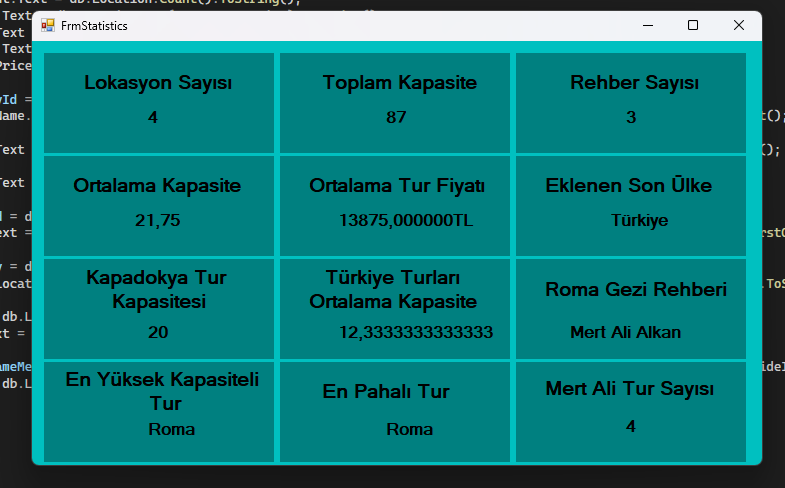

# CSharpTrainingCamp301

## Proje Hakkında

CSharpTrainingCamp301, Entity Framework ve Windows Forms kullanılarak hazırlanmış çok katmanlı (katmanlı mimari) bir örnek projedir. Projede temel olarak rehber, lokasyon ve müşteri işlemleri (CRUD), istatistiksel veriler ve yönetimsel işlemler yer almaktadır.

### Katmanlar

- **EntityLayer**: Varlık (model) sınıflarını içerir.
- **DataAccessLayer**: Entity Framework ile veri erişim işlemlerini yönetir.
- **BusinessLayer**: İş mantığı ve kurallarını barındırır.
- **EFProject**: Windows Forms arayüzü ile uygulamanın ana giriş noktasıdır.
- **PresentationLayer**: Alternatif veya ek sunum katmanı olarak kullanılabilir.

### Temel Özellikler

- Rehber ekleme, silme, güncelleme ve listeleme
- Lokasyon ekleme, silme, güncelleme ve listeleme
- İstatistiksel verilerin (toplam kapasite, ortalama fiyat, en pahalı tur vb.) gösterimi
- Entity Framework ile veritabanı işlemleri

## Kaynak

- **Kurs Eğitmeni:** Murat Yücedağ  
- **Kurs Linki:** [C# Eğitim Kampı - YouTube](https://youtube.com/playlist?list=PLKnjBHu2xXNPmFMvGKVHA_ijjrgUyNIXr&si=8ccNYXZ4mjy-sqbb)
